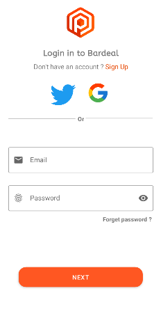

    
  <h1>Bardeal</h1>
  

An online shop under Android is a large app with many components of this program uses 
the **firebase** service and the UI design idea of this program is inspired by 
the following link. The minimum usable SDK is 21.

**use VPN** & **English system lang**

  
  
  
  

Tools:

- Firebase : https://firebase.google.com/
- Material Banner : https://github.com/sergivonavi/MaterialBanner
- Google Material Library : https://material.io/components?platform=android

UI Idea:

- Dribbble : https://dribbble.com/shots/15313224/attachments/7069931?mode=media

TODO :

- [ ] Change App architecture to [MVVM](https://en.wikipedia.org/wiki/Model%E2%80%93view%E2%80%93viewmodel)
- [ ] Use [Multithreading](https://developer.android.com/guide/components/processes-and-threads)
- [ ] Use Clean [Architecture](https://www.toptal.com/android/android-apps-mvvm-with-clean-architecture)
- [X] Use in project from [Firebase Authentication](https://firebase.google.com/docs/auth/?authuser=0)
- [Twitter](https://developer.twitter.com/en/docs)
- [Google](https://developers.google.com/android/guides/client-auth?authuser=0)
- [ ] Use [FireStore](https://firebase.google.com/docs/firestore?authuser=0) for Store data from Image to Text 

